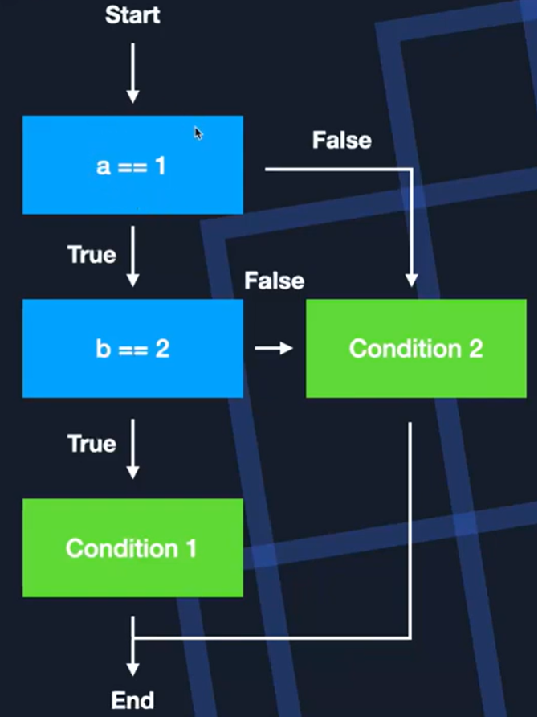
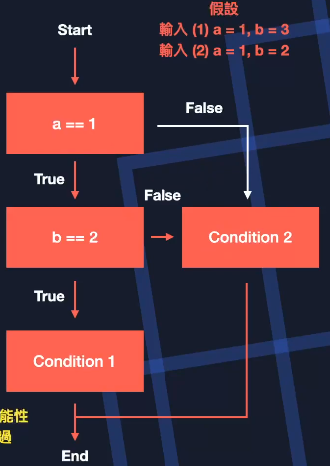
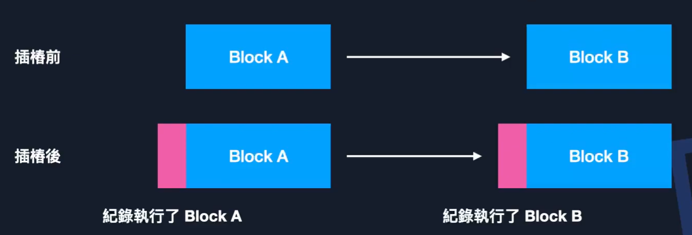
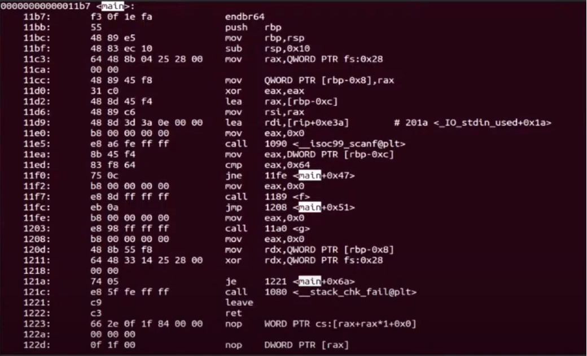
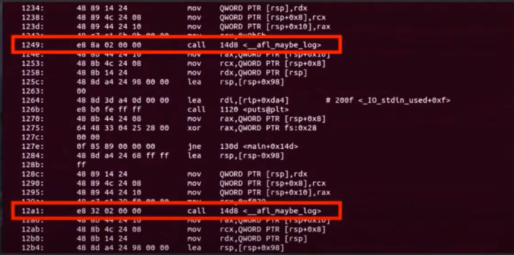
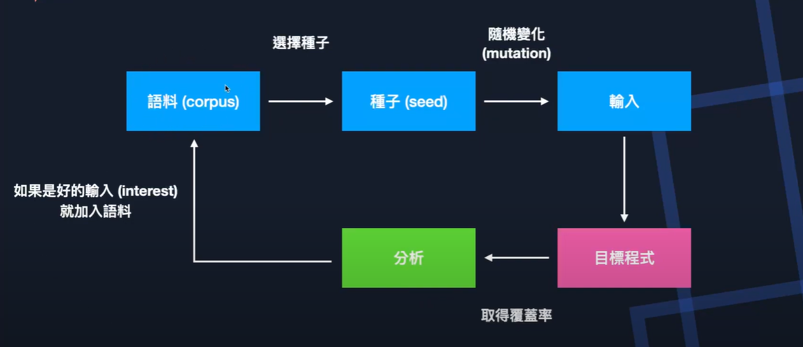
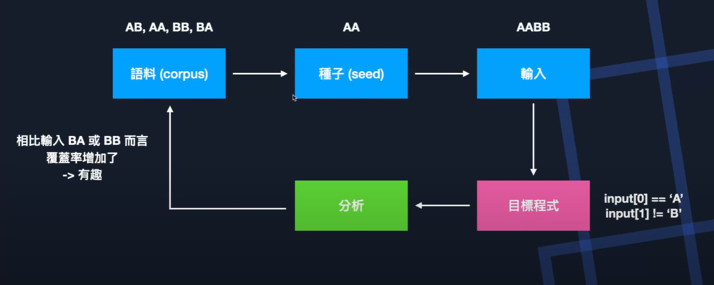

Introduction
===
🔙 [MENU README](./README.md)


# Fuzzing
1. Fuzzing vs. Unit
   - Unit Test是在測試功能是否正常運作
   - 模糊測試重點在於測試有沒有意料外的情況
2. 三大要素
   - Sanitizer : 只有在程式壞掉的時候才知道輸入有問題
   - Coverage  : 無法知道使有探索了全部的可能性
   - Mutation  : 輸入都是預設的，如何產生隨機輸入

---

# Basic Block
```
在同一個Basic Block中，只要執行其中一個指令
其他的就一定會被執行，不會中途跳到其他地方
如果有這種狀況，就該切成兩個Basic Block
```
```C
if(a == 1 && b == 2)
    printf("condition 1");
else
    printf("condition 2");
```
{:height="100px" width="250px"}

---

# Coverage
## Code Coverage
在程式中被測試到的比例為多少
```
1. Coverage       : 用來評量這次輸入探索多少程式碼的依據，分為以下兩種
2. Block Coverage : 用探索多少個Basic Block做為評量標準
3. Edge Coverage  : 用探索多少個Edge做為評量標準
```
{:height="100px" width="250px"}
```
1. 以Block Coverage來說會認為已經探索完全部的可能性
2. Edge Coverage則認為還有一條false沒有探索過

但不一定哪個方法比較好
```

## Instrumentation 插樁
```
如何記錄走過多少block/edge 來計算CodeCoverage
我們需要在計算的區塊執行之前，先執行一段用來記錄的程式碼
但其實也可以插在程式碼區塊的中間、後面
用來記錄參數、執行結果等
```






# Fuzzing Pocess


