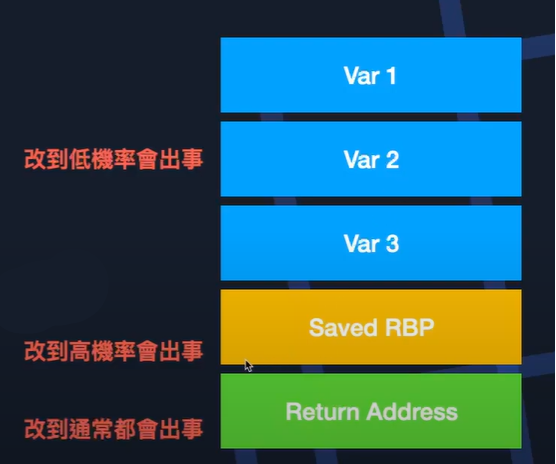
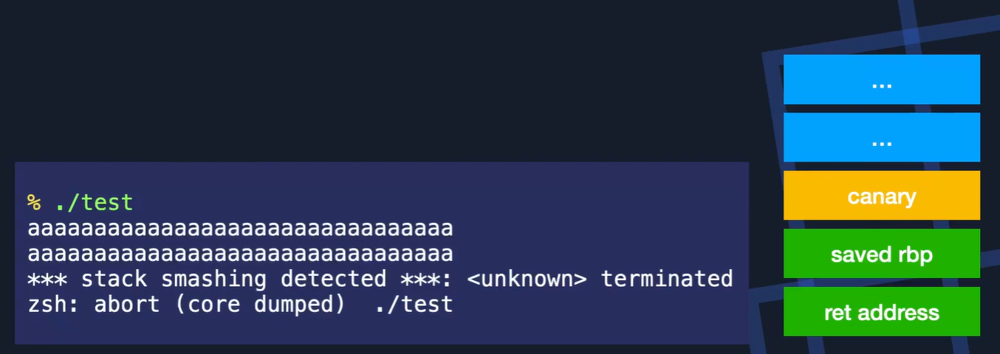
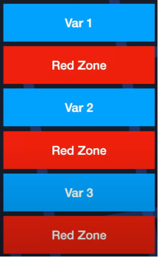
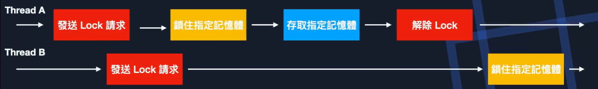

Sanitizer
===
🔙 [MENU README](./README.md)

# Sanitizer
1. 程式壞掉代表有觸發漏洞，但觸發漏洞並不一定會讓程式出錯
   - 只使用有沒有出錯當成判斷標準太過於簡陋
2. Sanitizer是在編譯的時候加入特殊程式碼來追蹤程式執行狀況的功能
   - AddressSanitizer
   - ThreadSanitizer
   - MemorySanitizer

---

# AddressSanitizer
1. AddressSanitizer可以偵測是否有使用到不該使用的區域
2. 以BufferOverflow為例
   - 如果BufferOverflow只有蓋到其他變數的話，不一定會發生錯誤

    {:height="100px" width="300px"}

3. Stack Canary
   - 在Saved RBP前塞一個random值，ret之前檢查是否相同，不同的話就會abort
   - 有canary的話不能蓋到return address、Saved RBP

    

3. AddressSanitizer就是在每個變數之間插入Red Zone
    如果Red Zone被改動了，那就代表有漏洞發生
    {:height="100px" width="150px"}

---

# ThreadSanitizer
1. ThreadSanitizer可以偵測是否有Race Condition存在
2. Race Condition
    打棒球時，有兩個打擊手同時揮棒，誰會打中的問題
    有兩條Thread同時在寫一塊記憶體空間，最後誰會寫到
    這一題沒有標準答案，需要實際執行才會知道結果
3. 如何防止Race Condition
   - 使用Lock機制
   - 在要使用記憶體區塊之前，先對那塊記憶體發送Lock請求
     通過後才能使用，期間針對該記憶體區塊的Lock請會被卡住
     也就是只有一個擊球員可以站在打擊區
    
4. ThreadSanitizer就是用來偵測非預期發生的RaceCondition
5. **主要關心兩種行為**
   - 記憶體存取行為(是否有複數個Thread同時在存取記憶體)
   - Locking & happens-before
     - 維護一個有限狀態機，監控是否有在lock解除之前就存取的狀況
     - Lock的實作實際上不是真的保護特定記憶體
       而是開發者自己要控管好，存取特定記憶體實就要先看Lock的狀態
 
 ---

 # MemorySanitizer
 1. MemorySanitizer可以偵測是否有使用未初始化的記憶體
 2. 做法是建立一個一對一的Shadow Memory(一個虛擬相同的Memory)
    - 如果有存取到某塊記憶體的話，就也將對應的Shadow Memory設成1
    - 可以做到bit level
    - 沒有用過的設成0，有用過的設成1
3. 讀取未初始化的Memory會不會有問題，這就不一定，但會有一些隨機的因素