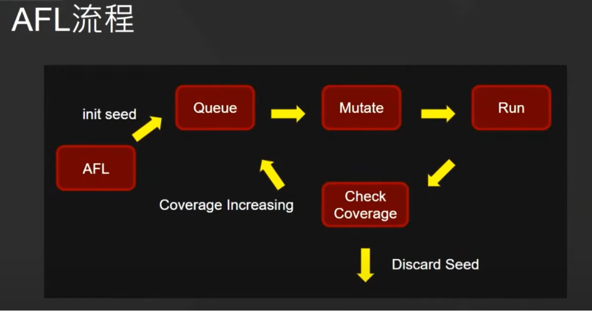
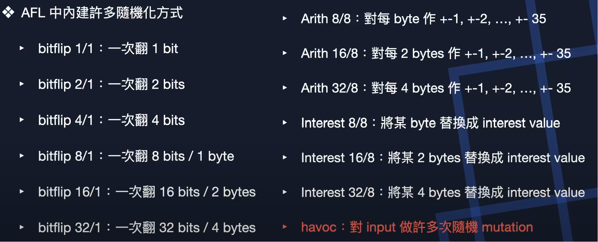

AFL
===
🔙 [MENU README](./README.md)

# AFL
1. AFL是由Google於2013開發，最經典且最著名的Fuzzer，目前已無更新
2. 使用觀念
   - 變異測試Mutate
   - 程式覆蓋率指引Code Coverage Guide
   - forkserver 

---

# Setting
- Install
    ```bash
    git clone https://github.com/google/AFL
    cd AFL
    make
    ```
- make之後路徑底下會產生多個執行檔案
    ```
    這些編譯器是經過修改的C/C++編譯器
    因為AFL需要插樁回報執行的狀態
    所以需要使用修改過的編譯器進行編譯


    afl-as       :Assembler
    afl-clang    :clang compiler (for C)
    afl-clang++  :clang compile (for C++)
    afl-fuzz     :AFL Main rountine
    afl-g++      :c++ compiler
    afl-gcc      :c compiler
    ```
- Enviroment Setting
    ```bash
    echo core | sudo tee /proc/sys/kernel/core_pattern
    echo performance | sudo tee /sys/devices/system/cpu/cpu*/cpufreq/scaling_governor
    ```

--- 

# AFL Process



# Mutation
AFL中內建許多隨機化的變異方式
```
由使用者提供一個可以正常運作的init seed
以init seed為基準去隨機化更多seed
====================================
Bitflip    : 1=>0 、 0=>1
Arith      : +1   、 -1
Interest   : bit => interest value
Dictionary : 自訂Dictionary
Havoc      : 選多個Mutation去做隨機
```
