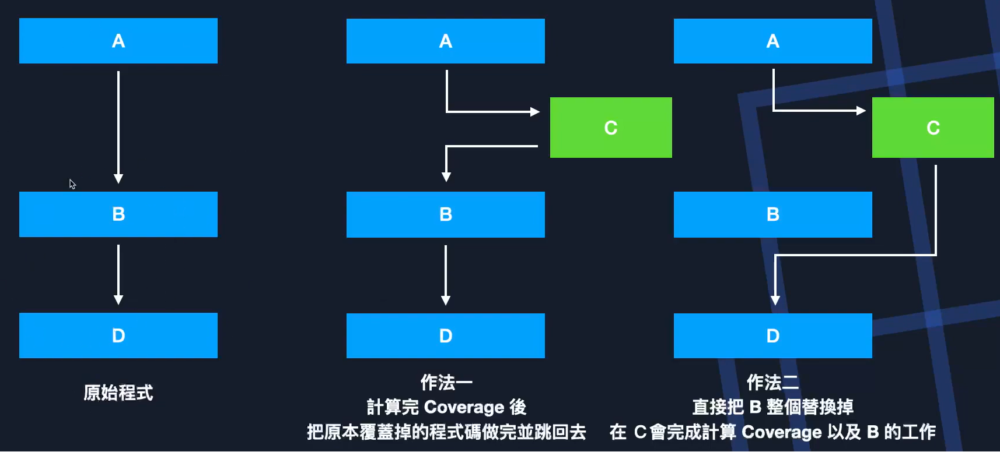
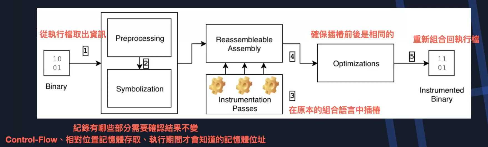
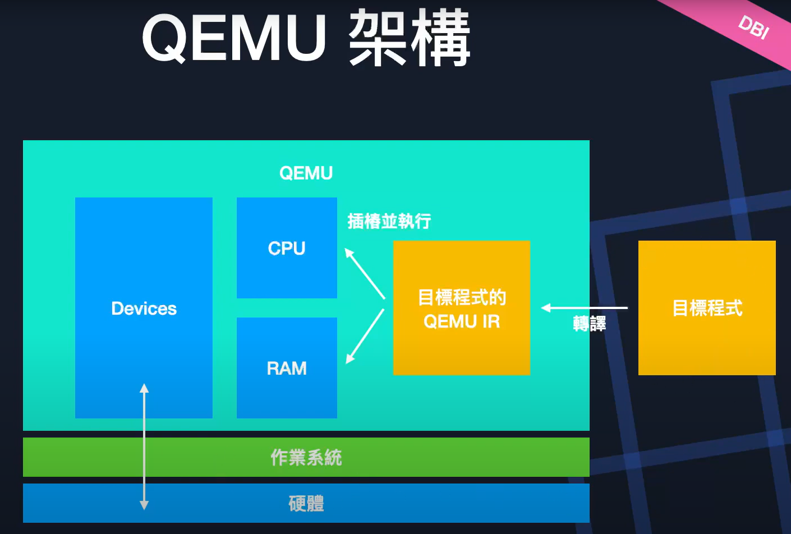

Binanry-only Fuzz
===
🔙 [MENU README](./README.md)

# Binanry-only Fuzz
1. 現實環境中遇到的程式大多沒有原始碼
   - 商用軟體不會開放原始碼
2. 那要如何針對執行檔做fuzz
   - Static binary rewriting
   - Dynamic binary instrumentation(DBI)

---

# Static binary rewriting
## Trampoline
1. Trampoline是彈跳床的意思，顧名思義
   就是跳出去計算Coverage後再跳回來
2. 將basic block開頭的instruction改成call/jmp，並跳到指定位址
   - **在指定位址會放蒐集Coverage的instruction**
   - 同時也會執行原本的程式
   - 最後跳回去
3. 這也是惡意程式中很常用到的技巧，很多惡意程式的混淆方式是
   會在執行中動態修改自己的程式碼，其中一種方式就是
   將basic block開頭的instruction改成call/jmp
   導致在執行的時候會跳到其他地方去執行

   

4. Trampoline的衍伸問題
   - 如果call/jmp的指令比原本的basic block還長怎麼辦?
   - Trampoline的程式碼要放在哪裡?
   - 如果這個basic block要存取記憶體中的相對位置，要怎麼取?
   - 被patch掉的指令要怎麼執行、在哪裡執行?

## Reassemble
```
核心概念: 把原本的組合語言修改後，再重新組譯回執行擋
         並確保程式執行流程仍與原本相同
```



---


# Dynamic binary instrumentation(DBI)
1. DBI顧名思義就是在執行的過程中，**動態的執行插樁程式碼**
   - 因此不能直接執行在系統上
2. DBI通常使用另一隻程式來**模擬**系統/程式的執行
   - 可以想像成使用虛擬機來執行程式
     並在虛擬機中更改它要執行的程式碼
3. DBI工具
   - QEMU(AFL-qemu) : 輕量化虛擬機
   - Intel PIN
   - DynamoRIO


> QEMU IR : QEMU自己用的組合語言
> QEMU Device會跟真正的硬體有一些互動