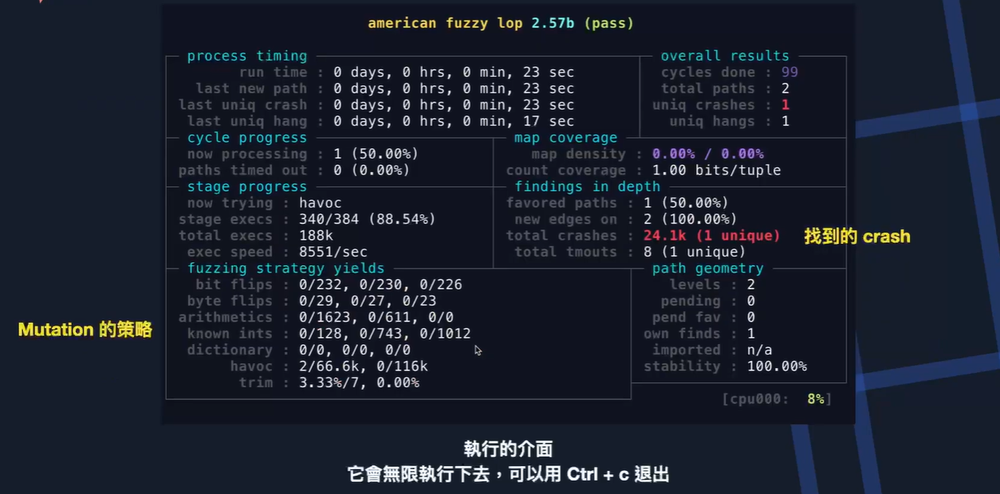
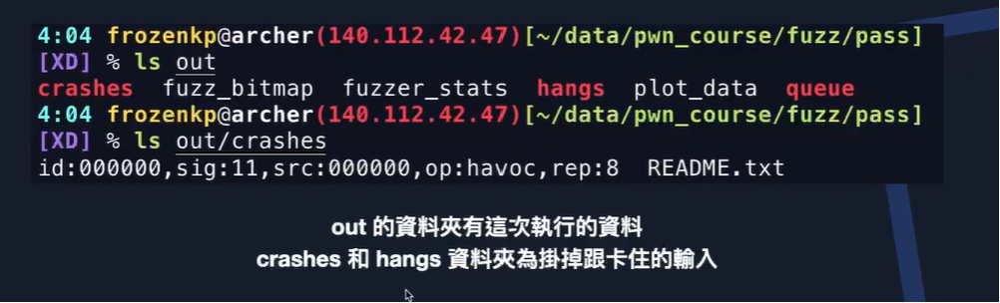

pass
===

# Compile
```bash
# 不開PIE和Stack Canary
gcc pass.c -fno-stack-protector -no-pie -o pass
```


# Hint
```
漏洞是read輸入後可以碰到return address和變數token
```

# Fuzz
Fuzz Test
```bash
# compile
afl-gcc pass.c -fno-stack-protector -no-pie -o pass

# generate seed
mkdir in && echo 'seed' > in/seed
# 這邊提供的seed是"seed"字串
# 也可以提供很多個
# 只要放在in資料夾即可

# Execute fuzzer
afl-fuzz -i in -o out ./pass
# 輸出到out資料夾
```





Review
```bash
# /out/crashes
ll
total 20
drwx------ 2 ubuntu ubuntu 4096 Apr  5 22:56 ./
drwx------ 5 ubuntu ubuntu 4096 Apr  5 22:56 ../
-rw------- 1 ubuntu ubuntu   33 Apr  5 22:56 id:000000,sig:11,src:000000,op:havoc,rep:16
-rw------- 1 ubuntu ubuntu   26 Apr  5 22:56 id:000001,sig:11,src:000001+000000,op:splice,rep:64
-rw------- 1 ubuntu ubuntu  600 Apr  5 22:56 README.txt


cat id:000000,sig:11,src:000000,op:havoc,rep:16 | xxd
00000000: 0004 0063 f900 473b 4747 4747 4747 4747  ...c..G;GGGGGGGG
00000010: 4747 4776 4747 4747 4747 4747 478d 0404  GGGvGGGGGGGGG...
00000020: ff                                       .
```
Crash Situation Test
```bash
cat id:000000,sig:11,src:000000,op:havoc,rep:16 | ../../pass 
Billy left his key in the locked room.
However, he forgot the token of the room.
Do you know what's the key?
Cannot open door. 0w0
Segmentation fault
```
GDB
```bash
=> 0x400800 <main+144>:	call   0x4006f0 <read@plt>

[------------------------------------stack-------------------------------------]
0000| 0x7fffffffde40 --> 0x7fffffffdf30 --> 0x1 
0008| 0x7fffffffde48 --> 0x0 
0016| 0x7fffffffde50 --> 0x0 
0024| 0x7fffffffde58 --> 0x7ffff7a2d840 (<__libc_start_main+240>:	mov    edi,eax)

```
```bash
=> 0x400815 <main+165>:	ret    

[------------------------------------stack-------------------------------------]
0000| 0x7fffffffde58 --> 0x4048d4747474747 
0008| 0x7fffffffde60 --> 0xff 
0016| 0x7fffffffde68 --> 0x7fffffffdf38 --> 0x7fffffffe2af ("/home/ubuntu/Desktop/FUZZ/pass/pass")
0024| 0x7fffffffde70 --> 0x1f7ffcca0 
0032| 0x7fffffffde78 --> 0x400770 (<main>:	lea    rsp,[rsp-0x98])

```